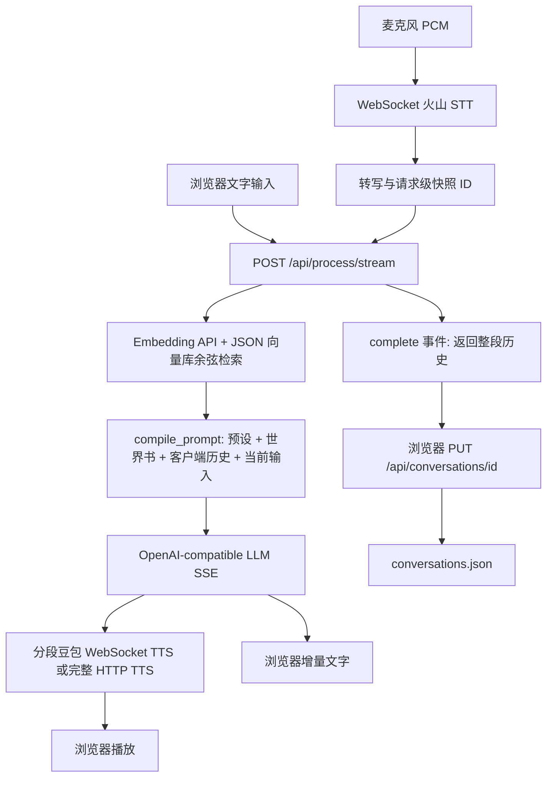

# WRX 接管与核心路径审计

日期：2026-10-01。基线：`96fb793a2fa22866e7f37982c8b02ebf8462af92`。

本报告依据克隆到本地的代码与离线检查。没有把旧项目已跑通的经验当作本次真实 API 测试结果；没有审计尚未定位的独立 Vector Memory、Serenity 或 Lutopia 仓库。

## 实际数据流

关键证据：`app/static/app.js:processAudio` 负责发送历史和完成后的保存；`app/main.py:process_stream` 不接受 conversation_id，不负责持久化本轮消息。`pipeline.py` 只做错误描述与语音正文清洗，实际编排集中在 main.py。

## 功能核对

“已有”表示代码存在；不代表真实服务或整套 Companion 已验收。

| 功能 | 状态 | 当前实现与差距 |
|---|---|---|
| 文字聊天 | 可复用 | 有文字输入并跳过 STT 调用，但仍要求三类 Profile、合成语音、清洗 Markdown |
| 多 Character | 缺失 | 无 Character 实体、角色列表和会话/记忆隔离 |
| Persona | 部分基础 | 世界书 user 分类/注入位置可复用，没有独立用户身份管理 |
| 预设 | 已有核心子集 | 多预设 CRUD、导入预览、复制、顺序/深度注入、参数白名单 |
| 世界书 | 已有核心子集 | 常驻、关键词、扫描深度、位置/角色/顺序；不等于完整酒馆兼容 |
| 原始历史 | 需改造 | role/content JSON 全量覆盖；不能保证服务端完整追加保存 |
| 多会话 | 基础已有 | ID、名称、会话创建/更新时间；未绑定角色 |
| 单消息时间/时区 | 缺失 | ChatMessage 只有 role/content；会话时间不等于消息时间 |
| Summary | 缺失 | 未发现总结生成、游标或总结版本管理 |
| Vector Memory | 可复用部分 | 手动知识库导入、远程 embedding、余弦召回、可选 rerank、切片查看 |
| 聊天自动向量入库 | 缺失 | 无 conversation → chunk → embed 的增量后台流程 |
| STT | 已有实现 | 火山非流式/流式识别；工厂固定使用 VolcengineStt |
| TTS/复刻音色 | 已有配置基础 | voice_type、HTTP 模板、豆包 WebSocket；本次未实测用户音色 |
| 语音交互 | 可复用 | 按键录音、边录边传、分段合成、停止播放；未见完整 VAD/服务端取消链路 |
| API 配置 | 可复用 | STT/LLM/TTS Profile、embedding/rerank 配置持久化和 Key 脱敏返回 |
| Input Tokens | 部分已有 | 尝试读 Provider input usage，否则明确标为估算；不持久化到消息 |
| Cache/Output Tokens | 缺失 | 未标准化读取、显示或保存；未发送 stream_options.include_usage |
| Web Search | 缺失 | 无搜索 Provider、工具循环或 AUTO/ON/OFF |
| Heartbeat/主动消息 | 缺失 | 无后台调度与正常消息落库路径 |
| iOS Push/微信 | 缺失 | 无 manifest、Service Worker、订阅或通道适配 |

## 需要解决的具体问题

1. **服务端不是历史的唯一来源。** `conversation_store.save_conversation` 直接替换 messages。两个页面可相互覆盖；JSON 写入只有临时文件替换，没有事务或并发版本控制。读取异常返回空列表，也可能让后续保存掩盖损坏。先建立服务端消息追加、幂等请求与事务，再做后台主动消息。
2. **多角色隔离尚不存在。** 预设、世界书与 Provider 的 active ID 是全局状态，向量检索跨所有启用库。未来必须显式绑定 character_id/conversation_id，共享库单独授权，避免不同角色互串记忆。
3. **文字与语音耦合。** `freeze_active_provider_snapshot` 要求三类 Profile；`normalize_voice_reply` 清洗最终持久化的 assistant 正文。应保留原始回复，单独生成可朗读文本；TTS 可按通道选择。
4. **向量规模和模型身份。** 全库 JSON、每轮深拷贝、全量余弦排序不适合目标规模。向量没有绑定 embedding 模型版本；更换同维度模型可能错误召回。可保留导入和 API 适配，后续选择索引后端并设计重建流程。
5. **Rerank 数量不一致。** `retrieve_vector_memories` 最多取 max_results × 2 个候选；`get_rerank_scores` 请求 top_n=max_results，却要求每个候选都有返回分数。合规返回 top_n 条时会触发异常并回退，而不是正常重排。此为静态确认的条件路径，尚未真实 API 复现；后续修复应加入对应回归检查。
6. **公开部署边界。** 当前没有路由鉴权，Provider Key 是服务器 JSON 明文存储；本地回环监听可作为接管环境，不能直接暴露成公网 Companion。云端部署阶段需身份验证、密钥保护、备份与 HTTPS。

## 初步实施建议

保留 Python/FastAPI 与现有语音 Provider、Prompt 编译器、预设/世界书导入器。逐步把 main.py 中的会话编排抽到共享 Core，避免重写已经可用的底层语音协议。

近期交付按可验证结果组织：

1. 先核对独立 Vector Memory 的总结、切片与召回策略，明确哪些已验证代码可以迁入。
2. 服务端持久化文字会话：角色/Persona 实体、会话绑定、原始消息、真实时间、usage、预设/世界书绑定；文字只配置 LLM 即可运行。
3. 总结与增量索引、角色隔离、记忆管理界面；原始记录始终保留。数据库/向量后端在容量与部署条件明确后决定。
4. 搜索 AUTO/ON/OFF、引用来源、真实 Token/Cache 展示，并让语音使用相同 Core。
5. 服务端 Heartbeat：可 NO_ACTION，发送则先落库，再通过持久化 outbox 投递。加入去重、静默时段、频率/调用预算和失败重试。
6. iOS Web Push 优先打通手机闭环，微信后置；论坛与生活行动继续作为扩展。

这不是正式完成 Phase 4：独立记忆项目与参考项目仍待核对。

## iOS 主动通知可行性

Apple/WebKit 文档确认：iOS/iPadOS 16.4 起，添加到主屏幕的 Web App 可以使用 Web Push。通知权限需由用户交互触发。方案需要 HTTPS、Web App 安装入口、通知订阅及服务端投递；不能依赖页面计时器模拟 Heartbeat。手机实机到达率、专注模式与通知权限仍需验收。

来源：[WebKit — Web Push for Web Apps on iOS and iPadOS](https://webkit.org/blog/13878/web-push-for-web-apps-on-ios-and-ipados/)。

## 本轮验证范围

- 安装项目依赖成功；Python 编译检查、JavaScript 语法检查通过。
- 6 项离线检查通过：静态页面、会话读写及隔离、缺失会话 404、世界书/历史/召回编译、Provider Key 脱敏、模拟 embedding 入库与检索及重复向量化跳过。
- TestClient 有一条依赖弃用警告，不影响此次通过结果。
- 未调用真实 STT/LLM/TTS/embedding；没有浏览器麦克风、断线恢复、并发负载或 iPhone 推送实测。
