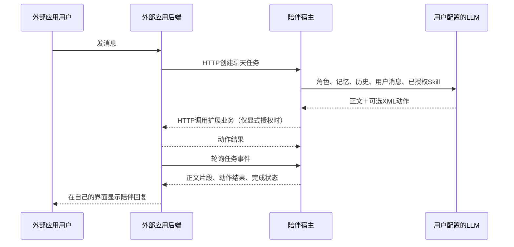

# 双向接入设计：将陪伴 AI 接入其他项目

更新：2026-10-06。状态：设计草案，尚未实现；本文不表示接口已经可用。面向完全读不到陪伴源码的应用开发者与开发 Agent。

## 当前能力和目标

WRX Companion 是用户本机运行的陪伴宿主，默认地址 http://127.0.0.1:2473/，负责角色、会话、历史、记忆、模型配置与模型请求。独立应用负责自己的界面和业务。应用间使用HTTP，不使用原生tool_calls。

当前扩展契约版本1只提供宿主启动应用、注入Skill、解析模型XML并调用扩展HTTP接口；结果在宿主界面显示，不自动再次请求模型。已有网页内部API支持角色、会话与聊天流，但没有面向外部应用的授权范围、稳定协议版本和事件访问边界。它们不是本文设计的双向接口，不能直接当作正式接入协议。

目标是让外部项目可以选择获准使用的陪伴角色，建立自己的会话，发送用户消息并读取回复；同时陪伴AI可以通过既有XML协议调用该应用。宿主仍持有模型密钥和陪伴数据，应用不需要导入宿主模块，也不自行拼装陪伴提示词。

本文全部 /api/bridge/v1 路径、bridge权限、启动变量和数据格式均为拟新增规范。现有extension.json不允许未知字段，不要将本文设计直接加入现有manifest。宿主桥接实现完成前，外部应用可以按本文写模拟服务与客户端，不能宣称已经能接入。

## 两条方向怎样组合



外部应用发消息与接收回复不依赖XML；XML只用于陪伴AI触发应用业务动作。模型生成和业务调用期间，应用后端必须能并发处理HTTP请求，不能等待模型完成时占住唯一业务线程，否则反向动作可能死锁。

最小版本采用HTTP任务＋轮询，不要求WebSocket、Webhook或跨域SSE。这样也适配现有扩展面板代理的普通HTTP限制。后续可单独新增事件流，但不能假设现有代理支持。

## 部署和授权

推荐用户电脑上同时运行宿主与外部应用后端。网页只访问自己的后端，后端访问宿主，避免把桥接令牌放进浏览器。宿主桥接默认只监听本机；异机、手机直连和公网部署需要另行实现TLS、用户认证与网关，不属于第一版。

用户在宿主中显式授权某个应用：可使用哪些角色、是否允许读取本应用历史、是否允许触发扩展动作。发现manifest或启用扩展本身不等于授权访问陪伴数据。

计划提供如下启动环境变量：

| 变量 | 用途 |
|---|---|
| WRX_COMPANION_BASE_URL | 宿主桥接基址，如http://127.0.0.1:2473/api/bridge/v1 |
| WRX_COMPANION_TOKEN | 宿主颁发给本次应用实例的桥接访问令牌 |

应用请求头使用 Authorization: Bearer <token>。这是应用访问宿主的令牌，与现有WRX_EXTENSION_TOKEN（宿主访问扩展）分开，不得混用。用户独立启动的应用使用宿主管理页生成的可撤销令牌；宿主启动的扩展则在用户授权后注入实例令牌。两种方式的权限检查相同。

拟定权限：characters:read（获准角色的最小信息）、conversations:create、conversations:read（仅应用所属会话）、messages:send、requests:read、requests:cancel；可选extensions:invoke控制是否允许本渠道生成扩展动作。令牌绑定应用ID、角色范围、会话归属和有效期。默认不能读取网页已有私人会话，不能修改角色、模型配置或记忆数据库；复用已有会话必须单独授权。

令牌撤销后拒绝新请求、取消未完成模型任务并禁止后续动作；已执行的物理副作用无法撤回。停用扩展撤销对应实例令牌；独立应用凭据撤销由管理页操作。授权状态存宿主私人data目录，不放manifest或Git。

## 拟新增HTTP协议

请求／响应JSON使用UTF-8；时间使用带时区的ISO 8601字符串。标识符为不透明字符串，客户端不可解析。第一版只接入文字，不开放图片、语音、Heartbeat、编辑重发、分支或重生成。

| 方法与路径（相对于桥接基址） | 功能 |
|---|---|
| GET /capabilities | 返回协议版本、限制、有效权限与授权角色范围 |
| GET /characters | 获准角色的id与name，不返回系统提示词或密钥 |
| POST /conversations | 为应用创建会话 |
| GET /conversations/{id} | 返回所属会话元信息，不返回内部debug |
| GET /conversations/{id}/messages?after={cursor}&limit=50 | 分页读取允许公开的正文历史 |
| POST /conversations/{id}/requests | 接收消息并创建模型任务，返回202 |
| GET /conversations/{id}/requests/{request_id} | 查询状态和最终正文 |
| GET /conversations/{id}/requests/{request_id}/events?after={cursor}&limit=100 | 分页轮询事件 |
| POST /conversations/{id}/requests/{request_id}/cancel | 幂等请求取消 |

创建会话：

```json
{"character_id":"role_123","name":"我的游戏伙伴","timezone":"Asia/Shanghai"}
```

响应201：

```json
{"id":"conv_456","character_id":"role_123","name":"我的游戏伙伴"}
```

发送消息：

```json
{"request_id":"client-generated-uuid","content":"我们去花园看看吧","timezone":"Asia/Shanghai"}
```

响应202：

```json
{"request_id":"client-generated-uuid","conversation_id":"conv_456","status":"queued"}
```

request_id由客户端生成，在重试同一消息时保持不变。幂等范围绑定应用、会话及request_id；相同ID与相同内容返回原任务，相同ID但不同内容返回409。每个会话同时只允许一个未结束任务，冲突返回409 conversation_busy。应用自动报告产生的新消息必须使用新ID，并经过用户可控策略，不能无限对话。

GET任务响应统一包含request_id、conversation_id、status、text、error；status只取queued、running、completed、failed、cancelled。未结束时text可为空；failed和cancelled允许返回部分正文，但不能标记完整回复。成功终态text是已经过滤XML的最终正文。

事件页响应：

```json
{
  "events":[
    {"cursor":"1","type":"request_started","data":{}},
    {"cursor":"2","type":"text_delta","data":{"text":"好呀，我们一起去。"}},
    {"cursor":"3","type":"request_completed","data":{"text":"好呀，我们一起去。"}}
  ],
  "next_cursor":"3",
  "has_more":false,
  "terminal":true
}
```

cursor为不透明游标，客户端只原样回传，不比较数字大小。事件按生成顺序返回，重连可能重复；客户端以cursor去重。text_delta只用于实时显示，完成时用最终text校正，不再把完整正文追加一遍。无新事件返回空数组与原游标，不做长连接；建议每0.5–1秒轮询，离开页面时停止。

事件类型固定为request_started、text_delta、action_result、request_completed、request_failed、request_cancelled。终态事件只发一种；error事件只含可公开错误码与消息。action_result包含extension_id、action、status（accepted／error／uncertain），仅返回该应用获准看到的业务结果；不得泄露其他扩展的设备、私人记录或令牌。

建议事件保留至少24小时、任务终态查询至少7天；这些是待实现的服务承诺，必须在capabilities返回实际保留时间。游标失效返回410 cursor_expired，客户端改查任务最终状态；不要重新发新request_id。重启时未完成任务标记failed，并说明结果可能不确定，不自动重放外部动作。

统一错误形状：

```json
{"error":{"code":"role_not_allowed","message":"该应用未获准使用此角色","retryable":false}}
```

400参数错误；401令牌无效；403权限不足；404不可访问资源（不泄露其他应用资源是否存在）；409重复ID内容不一致或会话忙；410事件过期；429请求过多；503模型不可用。HTTP 202仅代表任务接收，最终失败通过任务状态与事件返回。

拟定限制：content最多32 KiB UTF-8且非空，桥接JSON请求最多64 KiB；分页limit为1–100。并发、速率、事件保留和允许动作范围由capabilities公开。依赖数据与角色配置仍由用户在宿主准备，不允许外部应用静默改模型供应商。

## 外部应用的完整调用步骤

1. 用户启动宿主、配置角色与模型，在管理页授权应用，取得基址和令牌。
2. 应用后端请求capabilities并确认protocol_version=1；未提供接口或版本不兼容时显示未接入，不猜测内部网页API。
3. 获取获准角色，用户选择角色；创建应用专用会话，保存会话ID和角色ID。
4. 为用户消息生成request_id，发送POST任务；网络断开时先查询该ID，必要时用同一ID重试。
5. 持续轮询events，去重并显示正文；终态读取最终任务状态停止轮询。取消操作发送cancel，并等到取消或其他终态确认。
6. 若启用了模型触发应用业务，应用继续响应现有扩展/api/invoke；使用已有扩展侧令牌校验。聊天接口和动作接口的并发与责任分别管理。
7. 应用界面重新打开时恢复会话映射与任务ID；不因重连创建新的角色或会话。

客户端伪代码（不是当前可运行SDK）：

```text
caps = GET /capabilities with bridge token
assert caps.protocol_version == 1
conversation = create_or_restore_authorized_conversation()
request = POST /conversations/{id}/requests with stable request_id
cursor = saved_cursor_or_empty
while request is not terminal:
    page = GET .../events?after=cursor
    deduplicate_and_render(page.events)
    persist(page.next_cursor)
    if page.terminal: request = GET .../requests/{request_id}
    else: wait 0.5 to 1 second
render_final_state(request)
```

## 让陪伴主动回应应用事件

第一版只能由应用主动发送用户消息；应用主动发送业务事件必须与用户发言分开。计划后续新增独立事件入口，事件以“应用观察到的数据”身份进入上下文，不能伪装成system指令或真实用户发言。事件能否触发模型回复、频率、静默时段及收费由用户授权。

业务动作结果已经通过action_result返回外部应用。默认不把结果立即再次送给模型，保持一次回复正文＋XML的流程；如果产品需要AI看到执行结果再回答，应显式新增一轮，并展示其模型请求与费用。不得用回调反复触发自己形成循环。

“主动陪伴推送”、跨应用订阅、语音和共享会话不属于第一版实现范围，不能用普通HTTP响应假冒全局事件订阅。

## 宿主实现要求与验收

宿主新增独立bridge路由、授权存储、外部请求DTO和可公开事件映射，复用现有聊天核心的角色／记忆／模型编排；不要另写一套陪伴逻辑。内部事件、debug、提示词、配置和数据库字段不能直接透传给外部应用。

渠道应明确标记external，不能直接伪装web绕过权限检查。桥接默认不开放扩展动作；用户明确授权后只注入允许的扩展Skill，并复用现有XML隐藏、只读重放限制和副作用保护。撤销授权须在提交、流式生成与实际执行前检查，不能只在HTTP入口检查一次。不得新增原生tool_calls。

| 验收场景 | 预期 |
|---|---|
| 两个独立应用 | 无法读取彼此会话或任务 |
| 未授权角色／动作 | 请求被拒绝，模型上下文不包含该Skill |
| 同一ID重试、不同内容重用 | 前者不重复生成，后者409 |
| 流中断、游标过期、宿主重启 | 可查终态，不重复写消息或动作 |
| 正文＋XML | 正文可见，标签隐藏，授权动作最多一次 |
| 动作超时／取消 | 显示uncertain，不宣称未执行，不自动重放 |
| 撤销令牌／权限 | 拒绝新访问和后续动作 |
| 同会话并发请求 | 明确409，避免混合上下文 |
| 外部面板与反向调用并发 | 无单线程等待死锁 |
| 模型供应商报错 | 任务failed，只返回可公开错误 |

没有宿主源码时，开发Agent可按本契约写模拟HTTP服务、客户端及应用动作后端，验证JSON、轮询、幂等与错误展示。宿主实现完成后再真实联调角色、记忆、费用和XML动作；模拟通过不能称为宿主验收通过。

## 与现有文档的关系

现有已实现的应用端契约见[Extension开发指南](../extensions/DEVELOPER_GUIDE.md)。本文补的是应用访问陪伴宿主的方向；没有改变现有manifest，也没有新增可调用接口。

实施建议：先做仅文字、应用独立会话、授权与任务轮询；验收通过后再开放授权范围内的XML动作，最后考虑主动事件、语音和跨设备。每一阶段都需更新本文件状态及实际capabilities，防止开发者把设计草案当已发布协议。
